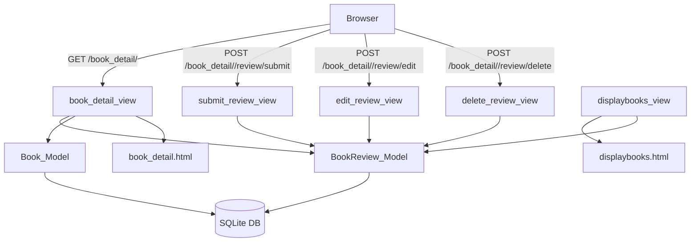

# Design Document: Book Comments & Ratings

## Overview

This feature adds a `BookReview` model to the BookEx Django application, allowing authenticated users to leave a text comment and a 1–5 star rating on any book. The design integrates cleanly with the existing `Book` and `User` models, follows the patterns already established in the codebase (function-based views, `@login_required`, Django forms, template inheritance), and requires no new third-party packages.

Key outcomes:
- A new `BookReview` model with a `UniqueConstraint` on `(user, book)`.
- A `BookReviewForm` Django form for submission and editing.
- Three new URL-mapped views: `submit_review`, `edit_review`, `delete_review`.
- Updates to `book_detail` and `displaybooks` views to pass review data.
- Template updates to `book_detail.html` and `displaybooks.html`.
- One new database migration.

---

## Architecture

The feature follows the existing Django MVT (Model-View-Template) architecture already used throughout BookEx. No new architectural layers are introduced.



**Request flow for review submission:**
1. Authenticated user POSTs the `BookReviewForm` to `submit_review`.
2. View validates the form; if the user already has a review for this book, it updates the existing record (`update_or_create`); otherwise it creates a new one.
3. On success, the view redirects to `book_detail` for the same book.
4. On validation failure, the view re-renders `book_detail.html` with form errors.

---

## Components and Interfaces

### New Model: `BookReview`

Defined in `bookEx/bookMng/models.py`.

```python
class BookReview(models.Model):
    book   = models.ForeignKey(Book, on_delete=models.CASCADE, related_name="reviews")
    user   = models.ForeignKey(settings.AUTH_USER_MODEL, on_delete=models.CASCADE,
                               related_name="book_reviews")
    rating = models.PositiveSmallIntegerField(
                 validators=[MinValueValidator(1), MaxValueValidator(5)])
    comment = models.TextField()
    created_at = models.DateTimeField(auto_now_add=True)
    updated_at = models.DateTimeField(auto_now=True)

    class Meta:
        ordering = ["-created_at"]
        constraints = [
            models.UniqueConstraint(fields=["book", "user"],
                                    name="unique_review_per_user_per_book")
        ]
```

### New Form: `BookReviewForm`

Defined in `bookEx/bookMng/forms.py`.

```python
class BookReviewForm(forms.ModelForm):
    rating = forms.IntegerField(
        min_value=1, max_value=5,
        widget=forms.NumberInput(attrs={"min": 1, "max": 5})
    )

    class Meta:
        model = BookReview
        fields = ["rating", "comment"]
```

### New Views

All views are function-based and live in `bookEx/bookMng/views.py`.

| View | Method | URL | Auth required |
|---|---|---|---|
| `submit_review` | POST | `book_detail/<int:book_id>/review/submit` | Yes |
| `edit_review` | POST | `book_detail/<int:book_id>/review/edit` | Yes |
| `delete_review` | POST | `book_detail/<int:book_id>/review/delete` | Yes |

**`submit_review(request, book_id)`**
- Decorated with `@login_required` and `@require_POST`.
- Uses `BookReview.objects.update_or_create(book=book, user=request.user, defaults={...})` to enforce the one-review-per-user-per-book rule at the application layer (the DB constraint is the safety net).
- Redirects to `book_detail` on success; re-renders with form errors on failure.

**`edit_review(request, book_id)`**
- Decorated with `@login_required` and `@require_POST`.
- Fetches the review with `get_object_or_404(BookReview, book=book, user=request.user)`.
- Returns HTTP 403 if the review's `user` does not match `request.user` (enforced by the query itself — a non-author simply gets a 404).
- Saves updated fields and redirects.

**`delete_review(request, book_id)`**
- Decorated with `@login_required` and `@require_POST`.
- Fetches with `get_object_or_404(BookReview, book=book, user=request.user)` — non-authors get 404.
- Deletes and redirects to `book_detail`.

### Updated Views

**`book_detail(request, book_id)`**
- Fetches all `BookReview` objects for the book (ordered by `-created_at`).
- Checks whether the current user already has a review (`user_review`).
- Passes `reviews`, `user_review`, and a `BookReviewForm` (pre-populated if `user_review` exists) to the template.

**`displaybooks(request)`**
- Annotates each `Book` queryset entry with `avg_rating` using `Avg("reviews__rating")` from `django.db.models`.
- Passes the annotated queryset to the template.

### URL Configuration

New entries added to `bookEx/bookMng/urls.py`:

```python
path('book_detail/<int:book_id>/review/submit', views.submit_review, name='submit_review'),
path('book_detail/<int:book_id>/review/edit',   views.edit_review,   name='edit_review'),
path('book_detail/<int:book_id>/review/delete', views.delete_review, name='delete_review'),
```

---

## Data Models

### `BookReview` fields

| Field | Type | Constraints |
|---|---|---|
| `id` | `BigAutoField` | PK, auto |
| `book` | `ForeignKey(Book)` | `CASCADE`, `related_name="reviews"` |
| `user` | `ForeignKey(User)` | `CASCADE`, `related_name="book_reviews"` |
| `rating` | `PositiveSmallIntegerField` | `MinValueValidator(1)`, `MaxValueValidator(5)` |
| `comment` | `TextField` | non-empty enforced by form |
| `created_at` | `DateTimeField` | `auto_now_add=True` |
| `updated_at` | `DateTimeField` | `auto_now=True` |

**Database constraint:** `UniqueConstraint(fields=["book", "user"], name="unique_review_per_user_per_book")` — prevents duplicate reviews at the DB level.

**Cascade behaviour:**
- Deleting a `Book` → all its `BookReview` records are deleted (`on_delete=CASCADE`).
- Deleting a `User` → all their `BookReview` records are deleted (`on_delete=CASCADE`).

### Average Rating Calculation

Computed at query time in the `displaybooks` view using Django's `Avg` aggregate:

```python
from django.db.models import Avg

books = Book.objects.annotate(avg_rating=Avg("reviews__rating"))
```

The template rounds to one decimal place using the `floatformat:1` filter:

```html
{{ book.avg_rating|floatformat:1|default:"No ratings yet" }}
```

### Migration

A single new migration (`0004_bookreview.py`) will be generated via `makemigrations`. It creates the `bookMng_bookreview` table and the unique index.

---

## Correctness Properties

*A property is a characteristic or behavior that should hold true across all valid executions of a system — essentially, a formal statement about what the system should do. Properties serve as the bridge between human-readable specifications and machine-verifiable correctness guarantees.*

### Property 1: Review submission round-trip

*For any* authenticated user, any book, any integer rating in [1, 5], and any non-empty comment string, submitting a valid `BookReviewForm` should result in a `BookReview` record retrievable from the database whose `user`, `book`, `rating`, and `comment` fields exactly match the submitted values.

**Validates: Requirements 1.1, 1.2**

---

### Property 2: Invalid input is rejected without side effects

*For any* form submission where the comment is composed entirely of whitespace (or is empty), or where the rating is an integer outside the range [1, 5], the system should return a validation error and the total count of `BookReview` records in the database should remain unchanged.

**Validates: Requirements 1.4, 1.5**

---

### Property 3: One review per user per book

*For any* authenticated user and any book, no matter how many review submissions are made for that `(user, book)` pair (with varying rating and comment values), the database should contain exactly one `BookReview` record for that pair, and it should reflect the most recently submitted values.

**Validates: Requirements 4.1, 4.3**

---

### Property 4: Review display completeness

*For any* non-empty set of `BookReview` records for a book, the rendered `book_detail` page should contain each review's author username, star representation of the rating, comment text, and submission date, and the reviews should appear in newest-to-oldest order.

**Validates: Requirements 2.1, 2.2, 2.3, 2.4, 2.5**

---

### Property 5: Average rating calculation

*For any* non-empty list of integer ratings in [1, 5] associated with a book, the `avg_rating` annotation produced by the `displaybooks` view should equal the arithmetic mean of those ratings rounded to one decimal place.

**Validates: Requirements 3.1, 3.3**

---

### Property 6: Edit round-trip

*For any* existing `BookReview` and any valid updated `(rating, comment)` pair, submitting the edit form as the review's author should update the stored record so that its `rating` and `comment` fields match the submitted values, with no new record created.

**Validates: Requirements 5.3**

---

### Property 7: Ownership enforcement

*For any* `BookReview` record and any authenticated user who is not the review's author, attempting to edit or delete that review should result in a non-2xx HTTP response, and the review record should remain unchanged in the database.

**Validates: Requirements 5.5**

---

### Property 8: Cascade delete removes all associated reviews

*For any* `Book` record with any number of associated `BookReview` records, deleting the `Book` should result in zero `BookReview` records remaining for that book. Likewise, for any `User` account with any number of authored `BookReview` records across any books, deleting the `User` should result in zero `BookReview` records authored by that user remaining in the database.

**Validates: Requirements 6.1, 6.2**

---

## Error Handling

| Scenario | Handling |
|---|---|
| Unauthenticated user submits review | `@login_required` redirects to `/accounts/login/` |
| Book ID not found | `get_object_or_404` returns HTTP 404 |
| User tries to edit/delete another user's review | Query filters by `user=request.user`; non-matching review returns HTTP 404 |
| Empty comment submitted | `BookReviewForm` validation fails; form re-rendered with error message |
| Rating outside 1–5 | `BookReviewForm` validation fails; form re-rendered with error message |
| Duplicate review (race condition) | DB `UniqueConstraint` raises `IntegrityError`; view catches it and redirects to the existing review's edit form |
| Book deleted while review form open | `get_object_or_404` on the book returns HTTP 404 |

---

## Testing Strategy

### Unit Tests (`bookEx/bookMng/tests.py`)

**Model tests:**
- `BookReview` can be created with valid data.
- `BookReview` with rating < 1 or > 5 fails `full_clean()`.
- `BookReview` with empty comment fails `full_clean()`.
- Deleting a `Book` cascades to its reviews.
- Deleting a `User` cascades to their reviews.
- The `UniqueConstraint` raises `IntegrityError` on duplicate `(book, user)`.

**Form tests:**
- `BookReviewForm` is valid for all integer ratings 1–5 with non-empty comment.
- `BookReviewForm` is invalid for rating 0, 6, and non-integer values.
- `BookReviewForm` is invalid for empty or whitespace-only comment.

**View tests (using Django `TestClient`):**
- `submit_review` redirects unauthenticated users to login.
- `submit_review` creates a new review for a valid POST.
- `submit_review` updates an existing review (no duplicate created).
- `edit_review` returns 404 when user does not own the review.
- `delete_review` removes the review and redirects.
- `book_detail` includes `reviews`, `user_review`, and `form` in context.
- `displaybooks` annotates books with `avg_rating`.

### Property-Based Tests

The project uses Python/Django, so **Hypothesis** is the appropriate property-based testing library. Each property test runs a minimum of 100 iterations (Hypothesis default `max_examples=100`).

**Property 1 — Review submission round-trip**
```python
# Feature: book-comments-ratings, Property 1: review submission round-trip
@given(rating=integers(min_value=1, max_value=5),
       comment=text(min_size=1).filter(str.strip))
def test_review_submission_round_trip(rating, comment): ...
```

**Property 2 — Invalid input rejected without side effects**
```python
# Feature: book-comments-ratings, Property 2: invalid input is rejected without side effects
@given(rating=one_of(integers(max_value=0), integers(min_value=6)),
       comment=text(min_size=1))
def test_invalid_rating_rejected(rating, comment): ...

@given(comment=text().filter(lambda s: not s.strip()))
def test_empty_comment_rejected(comment): ...
```

**Property 3 — One review per user per book**
```python
# Feature: book-comments-ratings, Property 3: one review per user per book
@given(submissions=lists(tuples(integers(1, 5), text(min_size=1).filter(str.strip)),
                         min_size=2, max_size=10))
def test_at_most_one_review_per_user_per_book(submissions): ...
```

**Property 4 — Review display completeness**
```python
# Feature: book-comments-ratings, Property 4: review display completeness
@given(reviews=lists(tuples(integers(1, 5), text(min_size=1).filter(str.strip)),
                     min_size=1, max_size=20))
def test_review_display_completeness(reviews): ...
```

**Property 5 — Average rating calculation**
```python
# Feature: book-comments-ratings, Property 5: average rating calculation
@given(ratings=lists(integers(min_value=1, max_value=5), min_size=1, max_size=100))
def test_avg_rating_equals_arithmetic_mean(ratings): ...
```

**Property 6 — Edit round-trip**
```python
# Feature: book-comments-ratings, Property 6: edit round-trip
@given(new_rating=integers(min_value=1, max_value=5),
       new_comment=text(min_size=1).filter(str.strip))
def test_edit_round_trip(new_rating, new_comment): ...
```

**Property 7 — Ownership enforcement**
```python
# Feature: book-comments-ratings, Property 7: ownership enforcement
@given(num_other_users=integers(min_value=1, max_value=5))
def test_non_author_cannot_edit_or_delete(num_other_users): ...
```

**Property 8 — Cascade delete removes all associated reviews**
```python
# Feature: book-comments-ratings, Property 8: cascade delete removes all associated reviews
@given(num_reviews=integers(min_value=1, max_value=10))
def test_cascade_delete_book_removes_reviews(num_reviews): ...

@given(num_reviews=integers(min_value=1, max_value=10))
def test_cascade_delete_user_removes_reviews(num_reviews): ...
```

**Integration / example-based tests:**
- `book_detail` page shows "No reviews yet" when no reviews exist (Requirement 2.6).
- `book_detail` page shows login prompt for unauthenticated users (Requirement 2.8).
- Unauthenticated POST to `submit_review` redirects to login (Requirement 1.3).
- Successful submission redirects to `book_detail` for the same book (Requirement 1.6).
- `book_detail` page pre-populates the form when the user already has a review (Requirement 4.2).
- `book_detail` page shows edit/delete controls only for the review author (Requirements 5.1, 5.2).
- Confirmed deletion redirects to `book_detail` (Requirement 5.4).
- `displaybooks` page shows "No ratings yet" for books with no reviews (Requirement 3.2).
